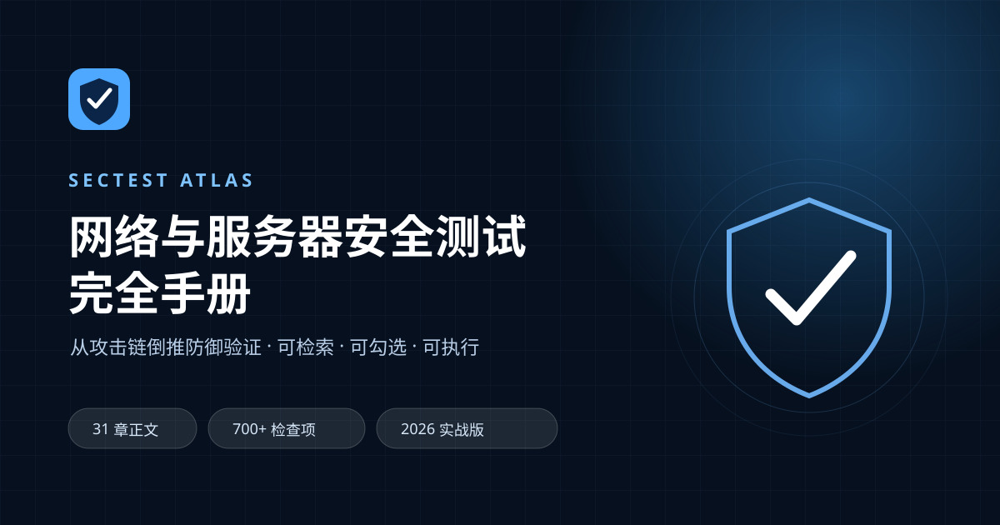
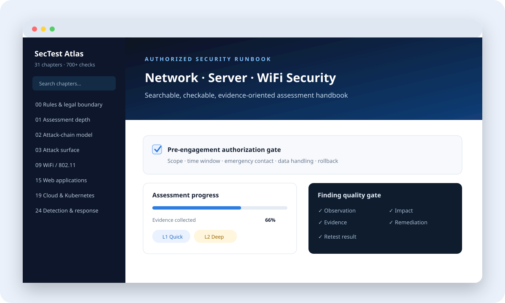

<div align="center">
  
</div>

# SecTest Atlas

<p align="center">
  <a href="README.md">English</a> ·
  <a href="INSTALL.md">安装说明</a> ·
  <a href="AI_INSTALL.md">AI 安装</a> ·
  <a href="docs/handbook.md">完整手册</a> ·
  <a href="CONTRIBUTING.md">参与贡献</a>
</p>

SecTest Atlas 是一份面向**合法授权安全评估**的中文实战手册。它以真实攻击路径为线索，将网络、服务器、无线、应用、云原生和 AI 系统风险整理成可检索、可勾选、可执行的检查项。

> [!WARNING]
> 本项目仅用于已经取得书面授权的安全评估、教学实验与防御验证。执行任何测试前，必须明确资产范围、测试时间窗、数据处理规则、回滚方案和应急联系人。

## 项目特点

- **31 章、700+ 检查项**，覆盖完整评估生命周期。
- **零依赖、无需构建**，直接打开 `index.html` 即可使用。
- 支持目录搜索、检查项进度保存、深色模式、移动端目录和打印/PDF 导出。
- 所有发现围绕现象、证据、影响、修复与复测组织。
- 提供授权书、ROE、发现记录和验收标准等可落地模板。



## 快速开始

```bash
git clone https://github.com/cndoin/sectest-atlas.git
cd sectest-atlas
python -m http.server 8080
```

浏览器访问 `http://localhost:8080`。项目不需要安装任何第三方依赖，也可以直接双击 `index.html` 阅读。

完整的 Windows、macOS、Linux 使用方式见 [INSTALL.md](./INSTALL.md)；如果希望让编程智能体自动安装和验收，请把 [AI_INSTALL.md](./AI_INSTALL.md) 交给智能体。

## 覆盖范围

| 维度 | 内容 |
| --- | --- |
| 方法体系 | PTES、NIST SP 800-115、OSSTMM、MITRE ATT&CK、CIS Benchmarks |
| 网络与主机 | L2–L4、DNS、边界分段、Linux/Windows、身份与凭据 |
| 应用与平台 | Web、API、微服务、云、容器、Kubernetes、CI/CD、供应链 |
| 无线与新技术 | WPA2/WPA3、Wi-Fi 6E/7、BLE、ZigBee、AI/LLM/智能体 |
| 运营与韧性 | 日志检测、紫队、备份恢复、勒索韧性、性能与混沌工程 |
| 交付落地 | 风险评级、报告模板、授权书、ROE、证据与验收标准 |

## 使用原则

1. 只测试明确写入授权范围的资产。
2. 高风险操作必须有单独审批、业务窗口和回滚方案。
3. 证据按最小必要原则采集，敏感数据必须脱敏并按约定销毁。
4. 每条发现都要说明现象、证据、实际影响、具体修复方式和复测结果。
5. 手册中的命令只是核查参考，不构成对任何外部目标的测试许可。

完整中文内容请阅读 [`docs/handbook.md`](./docs/handbook.md)。
